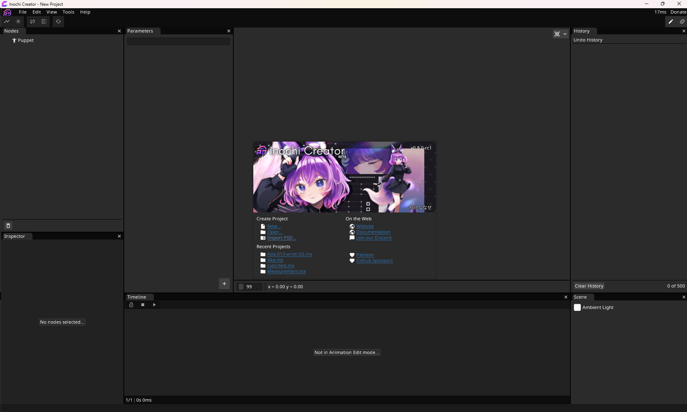
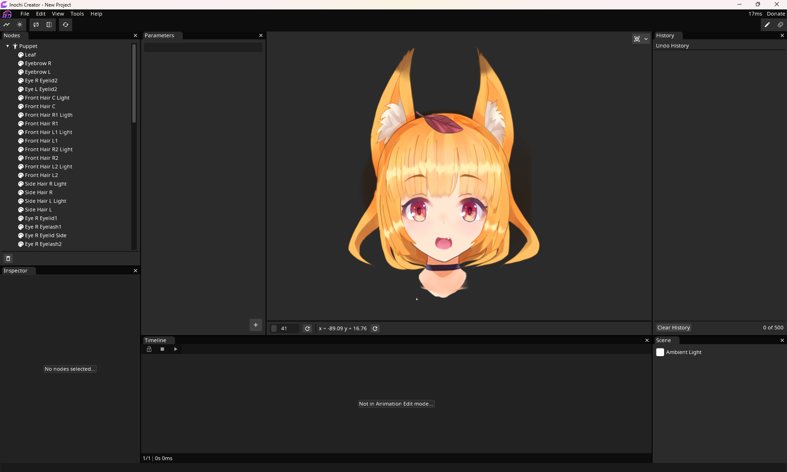
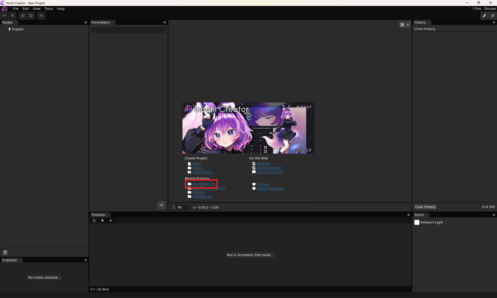

=============
1. Setting Up
=============

Getting the Tutorial Aka Model
------------------------------

Download the tutorial Aka model from :download:`here <tutorial-aka.psd>`.

This is a version of the Aka example model by Seagetch, but with only the head, which is what we'll focus on.

--------------------------

Importing the model in to Creator
---------------------------------

To import Aka, either click ``Import PSD`` within the startup window, or select ``File->Import->Photoshop Document`` from the main menu.

Once selected Inochi Creator should look like this:

.. admonition:: Something's off...
  :class: custom

  .. container:: ada-block

    .. image:: /img/ada-warning.png
      :class: ada
      :align: left
      :width: 128px
    
    You may wonder why the shadows are looking all garbled on her right now, right?

    All the shadow layers in the PSD are just bundled on to each other, so shadows cast shadows on shadows.
    We'll fix that in the coming chapters!

--------------------------

Saving and Loading a Model
--------------------------

Now that we have the model loaded in to Inochi Creator, let's save it!

| Go to the ``File->Save`` option in the main menu and select where to save it. 
| For now, let's save it as ``FirstModel`` in a location of your choosing.

If you now close and re-open Inochi Creator your project should be visible in the Recent Projects list!

