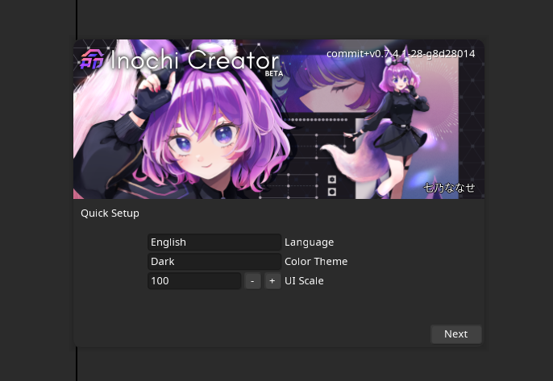

Getting Started with Inochi Creator
===================================

System Requirements
-------------------

The following system requirements have to be met before running Inochi Creator.

.. list-table:: 
    :header-rows: 1
    :stub-columns: 1

    * -
      - Minimum
      - Recommended
    * - Processor
      - x86_64 or ARM64 CPU [#req_cpu]_
      - Recent x86_64 or ARM64 CPU [#req_cpu]_
    * - Memory
      - 512 MB
      - 1 GB or more
    * - Disk Space
      - 100 MB or more [#req_space]_
      - 500 MB or more [#req_space]_
    * - Graphics Processor
      - OpenGL 3.2 Support [#req_gl]_, 512 MB VRAM
      - OpenGL 3.2 Support [#req_gl]_, 1 GB VRAM or more
    * - Display Resolution (Pixels)
      - 960x800 
      - 1920x1080 or higher 

Inochi Creator does not support 32 bit systems currently to reduce the maintenance burden.

------------

Downloading Inochi Creator
--------------------------

Inochi Creator is released in 2 streams, **Stable** and **Nightly**. 
Stable releases are generally recommended for having better stability, but it lacks behind in features with Nightly.
Meanwhile, Nightly is built by GitHub from the latest code every night, this means it has the latest features,
but also the latest bugs.

**Stable** is available to download on:
 - `Our Website <https://inochi2d.com>`__
 - `Itch.io <https://lunafoxgirlvt.itch.io/inochi-creator>`__
 - `GitHub <https://github.com/Inochi2D/inochi-creator/releases/latest>`__ 
 - `Flathub <https://flathub.org/apps/details/com.inochi2d.inochi-creator>`__

**Nightly** is available to download on:
 - `GitHub <https://github.com/Inochi2D/inochi-creator/releases/tag/nightly>`__

If you use *Itch.io's Launcher* or *Flatpak*, Inochi Creator will automatically stay updated.
Our ZIP and DMG packages do currently not auto-update, but we plan to change this in the future.

-----------

First Time Setup
----------------

First time you launch Inochi Creator the Welcome Screen will pop up,
you can set some basic settings here like Color Theme, Language and UI Scaling [#ui_nomac]_.

.. NOTE: The "Language" in quotes should be in English to instruct them that it's there
   where they can change the language of Inochi Creator.

Inochi Creator supports multiple languages, so if English is not your first language you may change the language,
by clicking the dropdown in the "Language" section

After having set up the basic settings you are then free to start creating Inochi2D models!

-----------

Notes
-----

.. [#req_cpu] *x86_64 and ARM64 refers to 64 bit CPUs by ARM, Intel and AMD.*

.. [#req_space] *Disk Space requirements depend on the size and amount of models you have on your system.*

.. [#req_gl] *OpenGL 3.2 is supported on the following GPUs:*
    
    - Gen 6 or later Intel HD Graphics on Linux and macOS
    - Gen 7 or later Intel HD Graphics on Windows
    - Nvidia GeForce 8 series or later
    - AMD Radeon HD 2000 series or later (marketed as TeraScale 1)
    - Apple Silicon M1 or later (OpenGL 3.1 with required extensions)

    VRAM requirements depend on the size of the model and texture count.

.. [#ui_nomac] *You will not see the UI scaling option on macOS*

    *This is intentional, UI Scaling is handled by the operating system on systems running macOS,
    To change the UI Scaling, open the system settings and change the UI scaling there.*
