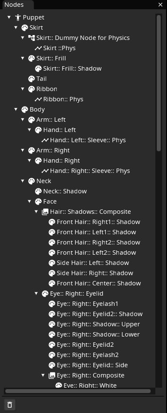
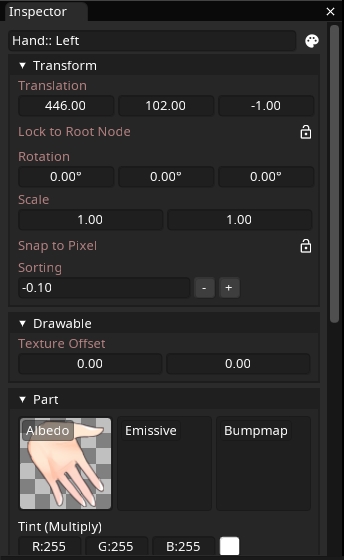

==========
Nodes
==========

Inochi2D is based of a concept called a `Scene Graph <https://en.wikipedia.org/wiki/Scene_graph>`__.

.. note::
   .. container:: ada-block

    .. image:: /img/ada-think.png
      :class: ada-right
      :align: right
      :width: 128px
    
    If you've used a modern game engine such as Godot, Unity, Unreal Engine or 3D modeling software such as Blender you may already be familiar with the concept!

    Think of Godot Nodes, or Unity GameObjects as the scene graph.

-------------

The scene graph is accessed via the Nodes panel, which displays them in a tree view.

| Each item in the tree is called *a Node*, each Node has a type on top of that. 
| 
| Every node has the concept of a Transform in common. A transform contains information about the position, rotation, scale and sorting index of the node.
|
| A node which is attached to another node is called a *child Node*, and the Node which the child is attached to is called the *parent Node*.
|
| Child Nodes inherit the position, rotation, scale and sorting index of their parents, which means if a parent nodes moves around, so will its children move around relative to it.
|
| The icon that a node has is used to denote its type to you.

-------------

| The properties of a Node are accessed via the Inspector panel, depending on the type of the Node, the items in the Inspector panel will change.
| 
| The Inspector Panel's contents are divided in to sections which can be collapsed by clicking their header, Each section contains settings for a specific subtype of that Node.
| 
| For example, a *Part* Node is based on the *Drawable* Node type, which in turn is based on the *Node* type. As such you will see properties for Node (Transform), Drawable and Part as sections.

.. toctree::
   :hidden:
   :maxdepth: 1
   :caption: Nodes
   :name: topic-nodes

   node.rst