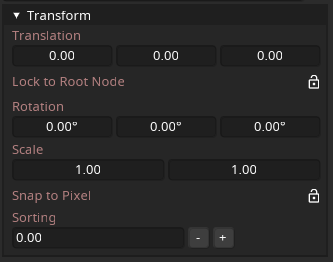

==========
Node
==========

The Node is the base Node type which all other Nodes inherit from, it only stores a Transform.

The transform stored by a Node will be inherited by its children. As such, children's position, rotation, scale and sorting index is relative to their parent.

A translation of ``0, 0, 0`` will result in the child node being in the center of its parent node.

.. tip:: 
   .. container:: ada-block

    .. image:: /img/ada-think.png
      :class: ada-right
      :align: right
      :width: 128px
    
    If you put a Node at ``0, 0, 0``, then add a child Node at ``0, 0, 32`` and rotate the parent around the Y axis, the child node will spin around its parent!

    How cool is that? 🦊

Translation
-----------

Translation is a fancy mathematical word for "position", the translation defines where the Node is in 3D space.

Lock to Root Node
-----------------

This option allows the translation, scale and rotation to be independent of the parent. In this mode the node moves only based on the special root node of the model.

This is useful if you have some static element you want to only move when the model itself moves.

Rotation
-----------------

The rotation of the Node in degrees in 3D space.

Scale
-----------------

The scale of the Node, as Nodes are generally 2D objects in 3D space you can only scale them on the X and Y axis.

Snap to Pixel
-----------------

Snaps the Node to the nearest pixel when moving.

Sorting
-----------------

The sorting index of the Node, smaller (and negative) numbers are closer to the camera, while bigger numbers are further away.

This value is used to define what Part is drawn in what order.
