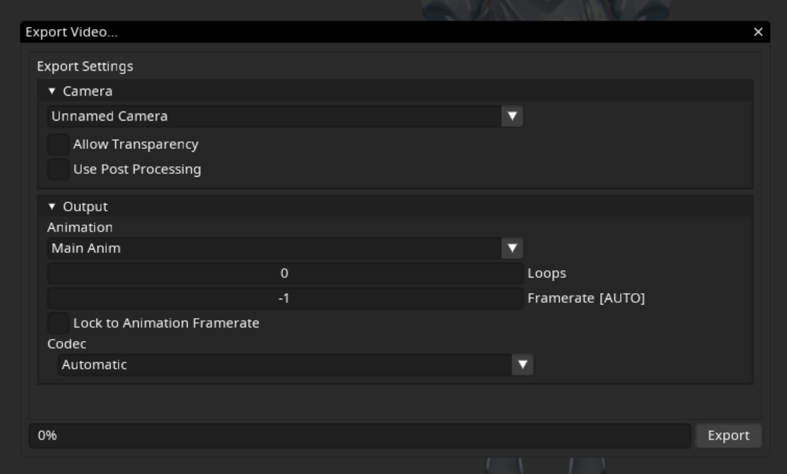

=======================
The Export Video Dialog
=======================

The video export dialog allows you to specify settings for the exported video.

Some settings may be discarded due to incompatibility with the output file format, such as discarding transparency for opaque video formats.

.. note::
   .. container:: ada-block

    .. image:: /img/ada-think.png
      :class: ada-right
      :align: right
      :width: 128px

    You will need at least 1 animation and 1 camera in your scene to export video!

    Otherwise you just get a sad error box telling you to go do that.

-----------

Camera
------

The following section allows you to adjust some settings about the camera for export.

Camera dropdown
~~~~~~~~~~~~~~~

The camera dropdown lets you select which camera to use, if the camera is affected by the Animation, then you can export video with zooms, pans, etc.

Allow Transparency
~~~~~~~~~~~~~~~~~~

Whether Inochi Creator should try to export the background with transparency, only some formats and codecs support this, though!

Use Post Processing
~~~~~~~~~~~~~~~~~~~

Whether Inochi Creator should use the scene lighting in the exported video, this allows your model to have glowing elements, etc.

-----------

Output
------

Animation dropdown
~~~~~~~~~~~~~~~~~~

Lets you select which animation to export to file.

Loops
~~~~~

How many times the main section of the animation should be looped, setting this value to 0 is semantically the same as setting it to 1.

Framerate
~~~~~~~~~

The framerate of the video file to export

Lock to Animation Framerate
~~~~~~~~~~~~~~~~~~~~~~~~~~~

Disables smoothing of mismatched framerates between video export and animation framerate.

Codec
~~~~~

Which video codec to use for export, by default Inochi Creator will try to automatically infer the codec.

Eg. for H.264 video you'll want to export an mp4 file, with the H.264 codec selected in the list.

.. warning:: 
  .. compound::

    .. image:: /img/ada-warning.png
      :class: ada
      :align: left
      :width: 128px

    The assumptions Inochi Creator makes with the Automatic option may be wrong!

    If you want to be 100% sure that Inochi Creator uses the right codec, please set it from the list!